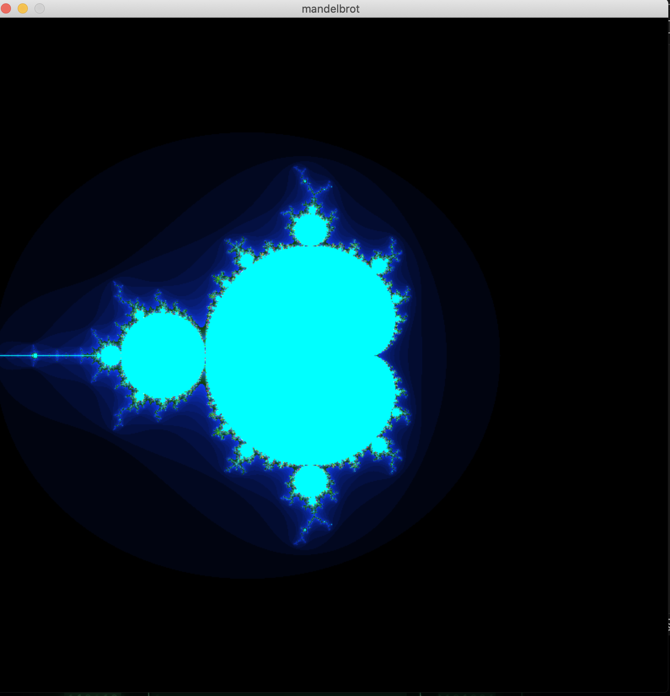
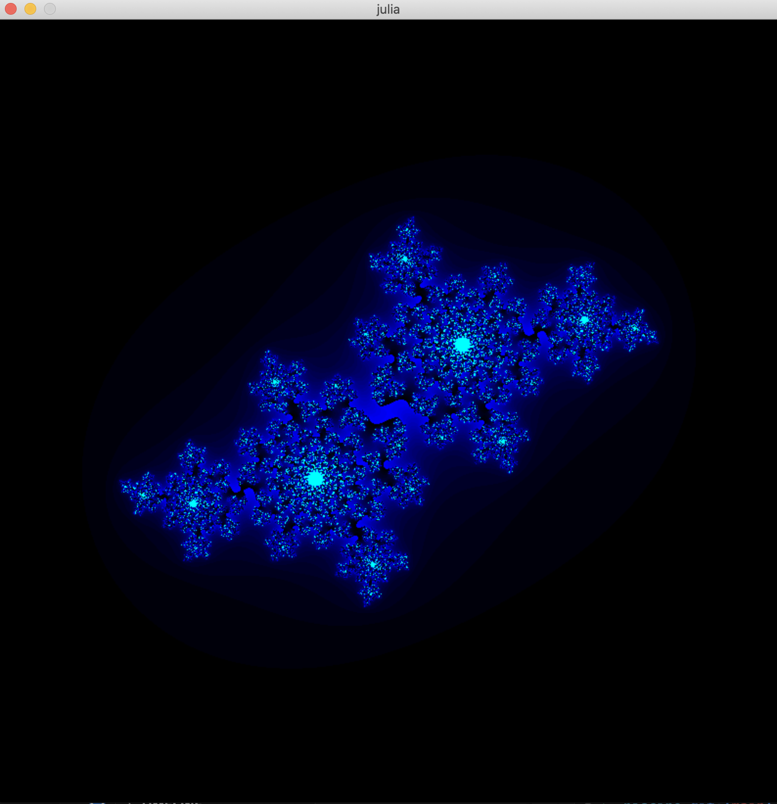

🌌 Fract-ol

This project is all about rendering fractals using the MiniLibX graphics library.
I used the folder-based version of the library, so you’ll find the full MinilibX included in this repository, as provided in the project instructions.
🔮 What's Inside

I implemented the Mandelbrot and Julia sets, as required by the mandatory part of the project.

    🌀 Mandelbrot Set: A beautiful fractal rendered with zoom and color.

    🌱 Julia Set: Can be displayed by providing real and imaginary values via command-line arguments.

💡 Extra Features I Added

After the evaluation, I added a few interactive upgrades:

    🎮 Dynamic Julia: If you launch the Julia set without any arguments, it opens in an interactive mode where mouse movement changes the real and imaginary values in real-time.

    ✨ Explore infinite fractal beauty with just your mouse and keyboard!

⚙️ Tech Stack

    C

    MiniLibX (graphics)

    Low-level math & event handling
# How to use 
compile with **make**

./fractol mandelbrot to get : 

./fractol julia -0.4 0.6 to get :

